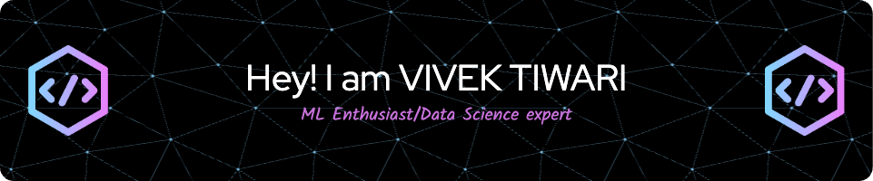

# Hi there, I'm Vivek Tiwari 👋 

  

  <em>Data Scientist passionate about leveraging machine learning and advanced analytics to uncover insights and drive growth.   Currently pursuing my Master's in Data Science at Indiana University Bloomington.</em>
   

---

### 👨‍💻 About Me

* 🎓 Pursuing M.S. in Data Science @ **Indiana University Bloomington** (Expected May 2025)
* 🎓 B.Eng. in Electronics & Computer Science @ **Thakur College of Engineering & Technology** (May 2023)
* 💡 Specializing in ML models (Python, SQL, Spark) for actionable insights.
* 🚀 Experienced in developing scalable data solutions and collaborating on strategic initiatives.
* 📊 Skilled in communicating complex findings to diverse audiences.
* 🌱 Eager to apply analytical rigor to optimize growth and efficiency, especially in fast-paced environments.

---

### 🛠️ Tech Stack

**Programming & Tools:**

  
   
  
  
  
  
  

**Machine Learning & AI:**

  
  
  
  
   
  

**Data Engineering & ETL:**

  
   
  
  
  
  

**Cloud Platforms & CI/CD:**

  
  
   

**Data Visualization:**

  
  
  
  

---

### 📈 Current Projects & Focus

* 🧠 Exploring hybrid transformer-GNN models for complex network analysis.
* ✨ Enhancing semantic feature extraction using spectral methods and graph self-attention.
* 📊 Developing predictive analytics solutions and optimizing data pipelines using Spark.
* 🤖 Building Generative AI applications for content optimization.
* 🛒 Improving recommendation engines for better user engagement.

*(Feel free to add more specific projects you're currently working on or learning here!)*

---

### 🤝 Connect with Me

  
  
  

---
