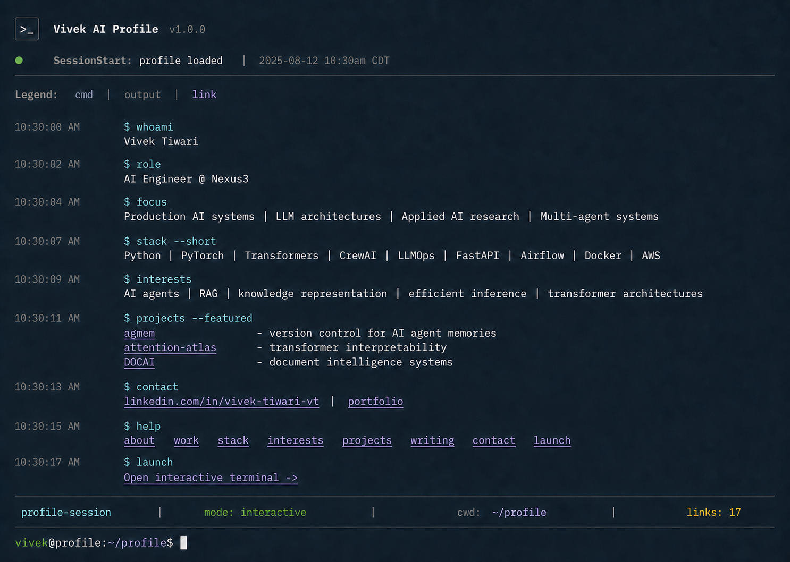

  

  <a href="https://vivek-tiwari-vt.github.io/vivek-tiwari-vt/">Open interactive terminal →</a>

The image above is the GitHub-safe snapshot. GitHub does not execute JavaScript inside a README, so the interactive version opens on [GitHub Pages](https://vivek-tiwari-vt.github.io/vivek-tiwari-vt/).
